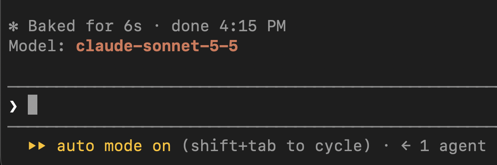

# claude-code-mods

Mods for Claude Code: small plugins of function hooks that run inside your session.

## Mods

| Mod | What it does |
| --- | --- |
| `model-badge` | Shows the active model above the prompt. Updates when you switch models. |



## Requirements

- A recent Claude Code CLI with plugin and mod support (`claude plugin --help` should work).
- Terminal session. `/plugin install` is not available in the desktop app's Code tab, but a mod installed from a terminal at user scope also loads there.

## Install

In a Claude Code terminal session, type:

```
/plugin install model-badge --marketplace emerson-buoy/claude-code-mods
```

Then:

1. Answer `y` to `Add marketplace?`
2. Press Enter to choose the user scope (every session) or pick another scope.
3. You should see `Installed model-badge. Plugin is now active.`

It is active immediately, no restart needed. You should see `Model: <name>` above the prompt.

## Uninstall

```
/plugin uninstall model-badge
```

## Try without installing

```
git clone git@github.com:emerson-buoy/claude-code-mods.git
claude --plugin-dir ./claude-code-mods
```

## Develop

```
npm run validate    # claude plugin validate .
npm run typecheck   # tsc -p . (needs the mod to have loaded once, see below)
npm test            # claude plugin test . (needs a *.test.ts)
```

There are no npm dependencies. The `claude-code` types are written by the engine into `.claude-plugin/types/` when the mod first loads (run `claude --plugin-dir .` once). That folder is generated and git-ignored.

Layout:

- `.claude-plugin/plugin.json` - manifest
- `.claude-plugin/marketplace.json` - makes this repo installable
- `hooks/hooks.json` - lists the hook modules
- `hooks/register.tsx` - the hooks
- `types/index.d.ts` - `$.state` contract

## Troubleshooting

- `Marketplace file not found`: check the `owner/repo` spelling and that you have access to the repo.
- `Plugin "model-badge" not found in marketplace`: the marketplace is cached; remove and re-add it.
- Nothing shows above the prompt: run `claude --debug` and look for lines starting with `model-badge:`.

## License

MIT
